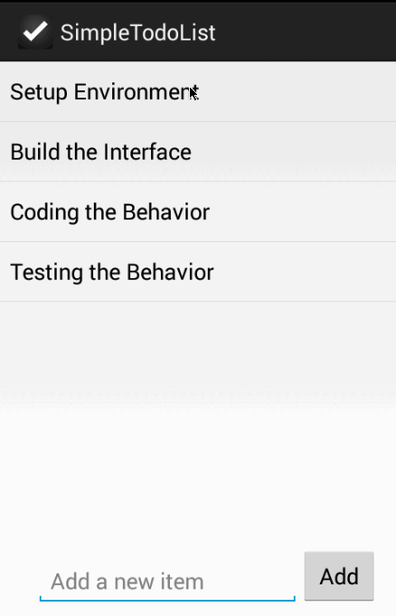

SimpleTodoApp
=============
This is an simple Todo Android application for Android BootCamp Course.

Time spent: 2 hours spent in total

Completed user stories:

* [x] Required: User can view a list of existing todo items
* [x] Required: User can add a new item to the todo list
* [x] Required: User can remove an item from the todo list

Walkthrough of all user stories:

GIF created with LiceCap.
